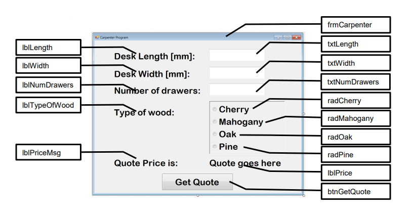

# Carpenter Program
A carpenter needs a program that computes the price of any desk a customer orders, based on the 
following input data: desk length and width in millimeters (mm), number of drawers and the type of wood. 
Compute the price as follows:

- The minimum charge for all desks is R1200. Declare this as a constant.
- Calculate the surface (length * width). If the surface is over 700000 square millimeters, add R300.
- For every drawer in the desk, there is an additional charge of R180.
- If the type of wood is “Cherry” or “Mahogany”, add R900; for “Oak”, add R750. No charge is added for “Pine”. Use a Nested..If statement to calculate this charge.
- Calculate the price.
- Display the price with the Rand symbol and two decimal places.

## Test Data:
| Length |  Width  | No. of drawers | Type of wood | Price |
|:-------|:-------:|---------------:|-------------:|------:|
| 1375 | 695 | 3 | Mahogany | R2940.00 |
| 790 | 580 | 2 | Oak | R2310.00 |
| 1560 | 900 | 5| Pine | R2400.00|

## Form Design:

