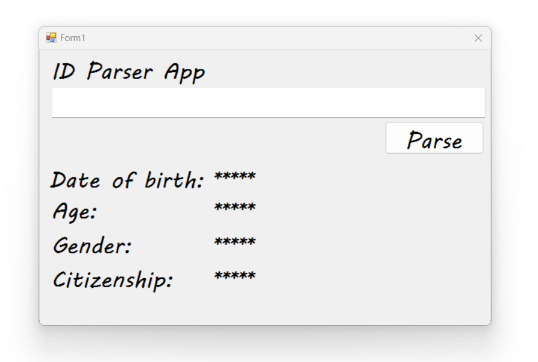

# ID Parser
ID Parser is a application that extracts and interprets key information from South African ID numbers. 
It provides the age, gender, date of birth, and citizenship status of the entered id number. I developed this exercise myself.

## Test Data:
| Id number |  Date Of Birth  | Age | Gender | Citizenship |
|:-------|:-------:|---------------:|-------------:|------:|
| 9801014800082 | 01/01/1998 | 28 | Female | SA Citizen |
| 8809165800083 | 16/09/1988 | 36 | Male | SA Citizen |
| 9609165800185 | 16/09/1996 | 28 | Male | Permanent Citizen |

These are not real id numbers!

## South African ID Format

The full format of a South African Id Number is YYMMDDSSSSCAV.
- YYMMDD - The first 6 digits are based on your date of birth.
- SSSS - The next 4 digits are used to define you gender.
- C - The next degit is used to classify citizenship.
- A - The next digit was used until 1980s to classify race.
- Z - The last digit is a checksum digit to verify the number.

## Data Extraction

- YY
```c# yy
string yy = idNumber.Substring(0, 2);
```
- MM
```c# mm
string mm = idNumber.Substring(2, 2);
```
- DD
```c# dd
string dd = idNumber.Substring(4, 2);
```
- SSSS
```c# ssss
string ssss = idNumber.Substring(6 , 4);
```
- C
```c# c
string c = idNumber.Substring(10 , 1);
```
- A
```c# a
string a = idNumber.Substring(12 , 1);
```
- Z
```c# z
string z = idNumber.Substring(13 , 1);
```


## Form Design:


