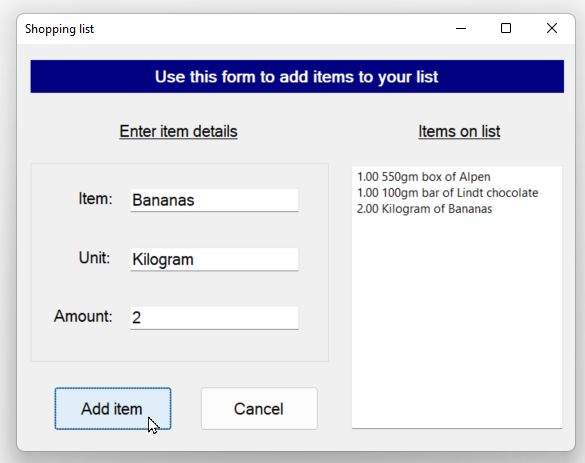

# Shopping List

Create a class to hold an item in a shopping list, and use this to create a shopping list
---

- Before you can do this exercise, you'll need to download and unzip the [file above ](https://github.com/NiqueWrld/DUT-Tutoring-Apps-APDA101-and-APDB101/raw/main/Shopping%20List/Shopping%20List.zip)


- If you haven't already got one, create a Windows Forms project (using Visual C#, obviously) called Shopping List. Right-click on your project in Solution Explorer to add an existing item, and choose the file Form1.cs in the above folder.

- Replace the existing Form1.cs. When you run your application, you should be able to add an item to your shopping list: 



The idea is that when you click on the ***Add item*** button, the item you've typed in should appear in the text box on the right.
---
Read on to find how to do this!

Create a class called ***ShoppingItem*** to hold each item, with the following properties:


| **Property**           | **Notes**                                                             |
|------------------------|-----------------------------------------------------------------------|
| **ItemName**           | The name of each item                                                 |
| **UnitNamer**          | The units for each item                                               | 
| **Amount**             | The amount to buy                                                     |
| **Description**        |  The description of the item to be added to the text box on the right | 


If all goes well you should be able to attach the following code to the Add item button (or something similar to it) to get your system working:
 ```csharp
// create a new item for your shopping list

var thing = new ShoppingListItem();

thing.ItemName = txtItem.Text;

thing.UnitName = txtUnit.Text;

thing.Amount = Amount;

// add the item to your list

// (adding carriage return first, if not first item)

if (txtList.Text.Length > 0) {

txtList.Text += Environment.NewLine;

}

txtList.Text += thing.Description;
```
Add a few items to your list, and check that they appear in the text box!

You can unzip [file above ](https://github.com/NiqueWrld/DUT-Tutoring-Apps-APDA101-and-APDB101/raw/main/Shopping%20List/Shopping%20List.zip) to see the answers to this exercise, although please remember this is for your personal use only.
